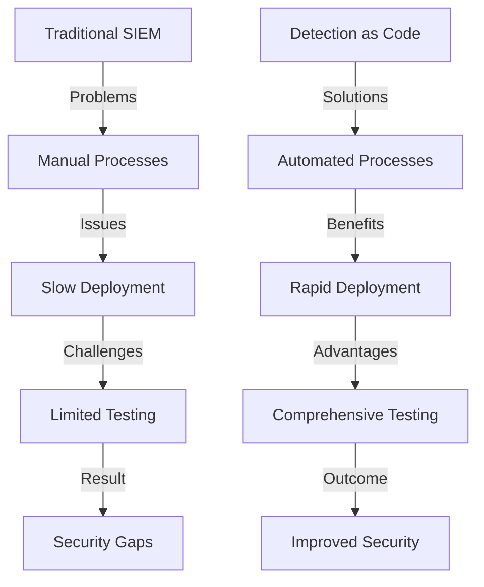
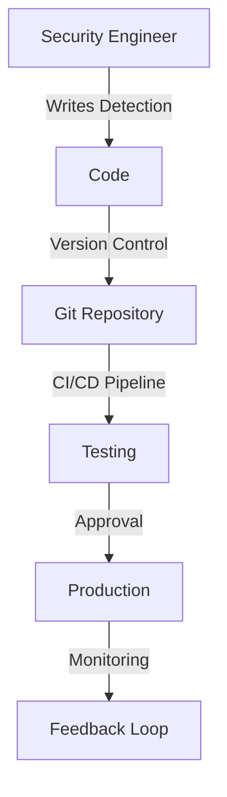
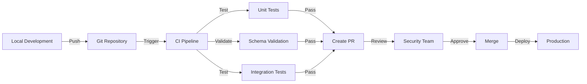

# Detection as Code: Modernizing Security Operations with Panther SIEM

Picture this: You're a security engineer, and you've just discovered a new threat pattern. Instead of clicking through a UI to create a detection rule, you write some code, test it locally, and push it to production through your CI/CD pipeline. That's Detection as Code (DaC) in action - and it's revolutionizing how security teams operate.

In this deep dive, we'll explore how Panther SIEM implements Detection as Code, its benefits, and how it fits into modern security operations. We'll walk through real examples, best practices, and even some gotchas to watch out for.

## The Evolution of Security Detection

### Traditional SIEM Approach: The Pain Points

Before we dive into Detection as Code, let's understand why we need it. Traditional SIEM approaches have several significant drawbacks:

1. **Manual Configuration**
   - Clicking through UIs to create rules
   - No version control
   - Difficult to track changes
   - Error-prone manual processes

2. **Limited Testing**
   - Rules are tested directly in production
   - No staging environment
   - Difficult to simulate real-world scenarios
   - High risk of false positives/negatives

3. **Poor Collaboration**
   - Single-user interface
   - No code review process
   - Difficult to share knowledge
   - Siloed security teams

4. **Slow Deployment**
   - Manual deployment processes
   - No automation
   - Time-consuming updates
   - Difficult to scale

5. **Limited Documentation**
   - Rules exist only in the SIEM
   - No self-documenting code
   - Knowledge transfer challenges
   - Difficult to maintain

### The Shift to Detection as Code

Detection as Code represents a paradigm shift in how security teams operate. It brings software engineering best practices to security operations:



## Comparison: Traditional vs. Detection as Code

| Aspect | Traditional SIEM | Detection as Code |
|--------|-----------------|-------------------|
| **Rule Creation** | UI-based, manual | Code-based, automated |
| **Version Control** | None or limited | Full Git integration |
| **Testing** | Production-only | Pre-production testing |
| **Deployment** | Manual | Automated CI/CD |
| **Collaboration** | Limited | Full team collaboration |
| **Documentation** | Manual | Self-documenting code |
| **Scalability** | Limited | Highly scalable |
| **Maintenance** | Time-consuming | Automated |
| **Error Handling** | Reactive | Proactive |
| **Knowledge Sharing** | Difficult | Built-in |
| **Change Management** | Ad-hoc | Structured |
| **Audit Trail** | Limited | Comprehensive |

## What is Detection as Code?

Detection as Code is exactly what it sounds like - treating your security detections like any other piece of code in your organization. Instead of manually configuring rules through a UI, you:

- Write detections in code (Python/YAML)
- Version control them
- Test them before deployment
- Deploy them through CI/CD pipelines
- Review and approve changes through pull requests



## Why Detection as Code?

### 1. Version Control and Change Management
Every change to your detections is tracked, reviewed, and can be rolled back if needed. No more "who changed what and when" mysteries.

### 2. Testing and Validation
You can test your detections against historical data before they hit production. No more "oops, that rule broke everything" moments.

### 3. Collaboration
Security teams can work together on detections, review each other's code, and maintain a single source of truth.

### 4. Automation
Deploy hundreds of detections with a single click. Update them across environments consistently.

### 5. Documentation as Code
Your detection logic is self-documenting. New team members can understand what a detection does by reading the code.

## Panther's Detection as Code Approach

Panther uses a combination of Python for detection logic and YAML for metadata, tests, and configuration. This separation of concerns makes detections more maintainable and testable. Let's look at a complete example:

### Complete Detection Example

1. **Python Rule Logic** (`rules/aws_root_user_activity.py`):
```python
#aws_root_user_activity.py
from panther_base_helpers import deep_get

def rule(event):
    # Only look at IAM events
    if event.get("eventSource") != "iam.amazonaws.com":
        return False
    
    # Check for root user activity
    if deep_get(event, "userIdentity", "type") == "Root":
        return True
    
    return False

def title(event):
    return f"Root user activity detected in account {event.get('recipientAccountId')}"

def dedup(event):
    return event.get("recipientAccountId")

def severity(event):
    return "HIGH"

def reference(event):
    return "https://docs.panther.com/detections/aws_root_user_activity"

def runbook(event):
    return """
    1. Verify if the root user activity was authorized
    2. Check if MFA was used
    3. Review the specific actions taken
    4. If unauthorized, rotate root user credentials
    """
```

2. **YAML Metadata** (`rules/aws_root_user_activity.yml`):
```yaml
AnalysisType: rule
Enabled: true
Filename: aws_root_user_activity
RuleID: aws.root.user.activity
LogTypes:
  - AWS.CloudTrail
Description: Alerts on any root user activity in AWS accounts
DisplayName: AWS Root User Activity
Tags:
  - AWS
  - IAM
  - Critical
Tests:
  - Name: Root user activity
    Log: |
      {
        "eventSource": "iam.amazonaws.com",
        "userIdentity": {
          "type": "Root"
        },
        "recipientAccountId": "123456789012"
      }
    ExpectedResult: true
  - Name: Non-root user activity
    Log: |
      {
        "eventSource": "iam.amazonaws.com",
        "userIdentity": {
          "type": "IAMUser"
        },
        "recipientAccountId": "123456789012"
      }
    ExpectedResult: false
  - Name: Non-IAM event
    Log: |
      {
        "eventSource": "ec2.amazonaws.com",
        "userIdentity": {
          "type": "Root"
        },
        "recipientAccountId": "123456789012"
      }
    ExpectedResult: false
```

### Directory Structure
```
panther-analysis/
├── rules/
│   ├── aws_root_user_activity.py
│   ├── aws_root_user_activity.yml
│   ├── aws_suspicious_api_activity.py
│   └── aws_suspicious_api_activity.yml
├── tests/
│   └── test_aws_root_user_activity.py
└── global_helpers/
    └── aws_helpers.py
```

### Complete Suspicious API Activity Detection

1. **Python Rule Logic** (`rules/aws_suspicious_api_activity.py`):
```python
from panther_base_helpers import deep_get
from datetime import datetime, timedelta

def rule(event):
    # Only process AWS API calls
    if not event.get("eventSource", "").endswith(".amazonaws.com"):
        return False
        
    # Get the API call details
    event_name = event.get("eventName", "")
    source_ip = deep_get(event, "sourceIPAddress")
    user_agent = deep_get(event, "userAgent")
    
    # Check for suspicious patterns
    suspicious_patterns = [
        "Delete",  # Destructive actions
        "Terminate",  # Resource termination
        "Modify",  # Configuration changes
    ]
    
    return any(pattern in event_name for pattern in suspicious_patterns)

def title(event):
    return f"Suspicious AWS API activity detected: {event.get('eventName')}"

def dedup(event):
    return f"{event.get('eventName')}-{event.get('sourceIPAddress')}"

def severity(event):
    return "HIGH"

def reference(event):
    return "https://docs.panther.com/detections/aws_suspicious_api_activity"

def runbook(event):
    return """
    1. Verify if the API call was authorized
    2. Check the source IP against known good IPs
    3. Review the user agent for anomalies
    4. If unauthorized, revoke the credentials used
    """
```

2. **YAML Metadata** (`rules/aws_suspicious_api_activity.yml`):
```yaml
AnalysisType: rule
Enabled: true
Filename: aws_suspicious_api_activity
RuleID: aws.suspicious.api.activity
LogTypes:
  - AWS.CloudTrail
Description: Detects suspicious API activity in AWS accounts
DisplayName: AWS Suspicious API Activity
Tags:
  - AWS
  - Security
  - Critical
Tests:
  - Name: Suspicious API call
    Log: |
      {
        "eventSource": "ec2.amazonaws.com",
        "eventName": "TerminateInstances",
        "sourceIPAddress": "192.168.1.1",
        "userAgent": "aws-cli/1.18.69"
      }
    ExpectedResult: true
  - Name: Normal API call
    Log: |
      {
        "eventSource": "ec2.amazonaws.com",
        "eventName": "DescribeInstances",
        "sourceIPAddress": "192.168.1.1",
        "userAgent": "aws-cli/1.18.69"
      }
    ExpectedResult: false
  - Name: Non-AWS event
    Log: |
      {
        "eventSource": "custom.api",
        "eventName": "DeleteResource",
        "sourceIPAddress": "192.168.1.1"
      }
    ExpectedResult: false
```

### Unit Tests (`tests/test_aws_root_user_activity.py`)
```python
from rules.aws_root_user_activity import rule

def test_root_user_activity():
    # Test case 1: Root user activity
    assert rule({
        "eventSource": "iam.amazonaws.com",
        "userIdentity": {
            "type": "Root"
        }
    }) is True
    
    # Test case 2: Non-root user activity
    assert rule({
        "eventSource": "iam.amazonaws.com",
        "userIdentity": {
            "type": "IAMUser"
        }
    }) is False
    
    # Test case 3: Non-IAM event
    assert rule({
        "eventSource": "ec2.amazonaws.com",
        "userIdentity": {
            "type": "Root"
        }
    }) is False
```

## CI/CD Integration

Here's how Panther fits into your CI/CD pipeline:



### Example GitHub Actions Workflow

```yaml
name: Panther Detection CI/CD

on:
  push:
    branches: [ main ]
  pull_request:
    branches: [ main ]

jobs:
  test:
    runs-on: ubuntu-latest
    steps:
      - uses: actions/checkout@v2
      
      - name: Set up Python
        uses: actions/setup-python@v2
        with:
          python-version: '3.9'
          
      - name: Install Panther Analysis Tool
        run: pip install panther-analysis-tool
        
      - name: Run Tests
        run: |
          panther-analysis-tool test
          panther-analysis-tool validate
          
      - name: Deploy to Production
        if: github.ref == 'refs/heads/main'
        run: |
          panther-analysis-tool upload
```

## Best Practices for Detection as Code

1. **Start Small, Scale Fast**
   - Begin with critical detections
   - Build a library of reusable functions
   - Create templates for common patterns

2. **Testing is Non-Negotiable**
   - Unit test every detection
   - Test against historical data
   - Simulate attack scenarios

3. **Document Everything**
   - Clear detection descriptions
   - Example logs for testing
   - MITRE ATT&CK mappings

4. **Security Review Process**
   - Require peer review for all changes
   - Maintain a security champion program
   - Regular detection effectiveness reviews

## Common Pitfalls to Avoid

1. **Over-Engineering**
   - Keep detections simple and focused
   - Avoid complex logic unless necessary
   - Document why complex logic is needed

2. **Testing Gaps**
   - Don't skip test cases
   - Test edge cases
   - Validate against real-world scenarios

3. **Version Control Hygiene**
   - Use meaningful commit messages
   - Keep PRs focused and small
   - Maintain clean git history

## Real-World Example: Implementing a Detection Pipeline

Let's walk through implementing a detection for suspicious AWS API activity:

1. **Create the Detection**
```python
from panther_base_helpers import deep_get
from datetime import datetime, timedelta

def rule(event):
    # Only process AWS API calls
    if not event.get("eventSource", "").endswith(".amazonaws.com"):
        return False
        
    # Get the API call details
    event_name = event.get("eventName", "")
    source_ip = deep_get(event, "sourceIPAddress")
    user_agent = deep_get(event, "userAgent")
    
    # Check for suspicious patterns
    suspicious_patterns = [
        "Delete",  # Destructive actions
        "Terminate",  # Resource termination
        "Modify",  # Configuration changes
    ]
    
    return any(pattern in event_name for pattern in suspicious_patterns)

def title(event):
    return f"Suspicious AWS API activity detected: {event.get('eventName')}"

def dedup(event):
    return f"{event.get('eventName')}-{event.get('sourceIPAddress')}"

def severity(event):
    return "HIGH"

def reference(event):
    return "https://docs.panther.com/detections/aws_suspicious_api_activity"

def runbook(event):
    return """
    1. Verify if the API call was authorized
    2. Check the source IP against known good IPs
    3. Review the user agent for anomalies
    4. If unauthorized, revoke the credentials used
    """
```

2. **Add Tests**
```python
def test_rule():
    # Test case 1: Normal API call
    assert not rule({
        "eventSource": "ec2.amazonaws.com",
        "eventName": "DescribeInstances",
        "sourceIPAddress": "192.168.1.1"
    })
    
    # Test case 2: Suspicious API call
    assert rule({
        "eventSource": "ec2.amazonaws.com",
        "eventName": "TerminateInstances",
        "sourceIPAddress": "192.168.1.1"
    })
    
    # Test case 3: Non-AWS event
    assert not rule({
        "eventSource": "custom.api",
        "eventName": "DeleteResource"
    })
```

3. **Deploy Through CI/CD**
```yaml
# .github/workflows/panther.yml
name: Panther Detection Deployment

on:
  push:
    branches: [ main ]
  pull_request:
    branches: [ main ]

jobs:
  deploy:
    runs-on: ubuntu-latest
    steps:
      - uses: actions/checkout@v2
      
      - name: Set up Python
        uses: actions/setup-python@v2
        with:
          python-version: '3.9'
          
      - name: Install dependencies
        run: pip install panther-analysis-tool pytest
        
      - name: Run tests
        run: |
          pytest tests/
          panther-analysis-tool test
          
      - name: Deploy to production
        if: github.ref == 'refs/heads/main'
        run: panther-analysis-tool upload
```

## Advanced Features and Considerations

### 1. Data Models
Panther allows you to define data models for consistent log parsing:

```python
from panther_base_helpers import deep_get

class AWSCloudTrail:
    def __init__(self, event):
        self.event = event
        
    @property
    def event_source(self):
        return self.event.get("eventSource")
        
    @property
    def event_name(self):
        return self.event.get("eventName")
        
    @property
    def user_identity(self):
        return deep_get(self.event, "userIdentity", "type")
```

### 2. Global Helper Functions
Create reusable functions across detections:

```python
# global_helpers.py
def is_suspicious_time(event_time):
    """Check if the event occurred during non-business hours"""
    hour = event_time.hour
    return hour < 9 or hour > 17

def is_known_bad_ip(ip_address):
    """Check if the IP is in a known bad list"""
    return ip_address in KNOWN_BAD_IPS
```

### 3. Correlation Rules
Detect sequences of events:

```yaml
AnalysisType: correlation
Enabled: true
Filename: aws_privilege_escalation
RuleID: aws.privilege.escalation
LogTypes:
  - AWS.CloudTrail
Description: Detects potential privilege escalation in AWS
DisplayName: AWS Privilege Escalation
Tags:
  - AWS
  - IAM
  - Critical
Tests:
  - Name: Privilege escalation sequence
    Logs: |
      [
        {
          "eventSource": "iam.amazonaws.com",
          "eventName": "CreatePolicyVersion",
          "userIdentity": {
            "type": "IAMUser"
          }
        },
        {
          "eventSource": "iam.amazonaws.com",
          "eventName": "AttachUserPolicy",
          "userIdentity": {
            "type": "IAMUser"
          }
        }
      ]
    ExpectedResult: true
```

## Conclusion

Detection as Code isn't just a buzzword - it's a fundamental shift in how security teams operate. By treating detections as code, we gain:

- Better collaboration
- Improved reliability
- Faster deployment
- Easier maintenance
- Better documentation

Panther's implementation of Detection as Code provides a robust framework for modern security operations. Whether you're writing Python detections for complex logic or YAML rules for simple patterns, the principles remain the same: version control, test, review, and deploy.

Remember: The goal isn't to write perfect detections on the first try. It's to create a process that allows you to iterate, improve, and adapt your security posture continuously.

## Additional Resources

- [Panther Documentation](https://docs.panther.com)
- [Detection as Code Best Practices](https://docs.panther.com/best-practices)
- [MITRE ATT&CK Framework](https://attack.mitre.org)
- [Security Detection Engineering](https://github.com/security-detection-engineering)
- [Panther Analysis Tool (PAT)](https://github.com/panther-labs/panther-analysis-tool)
- [Sigma Rules to Panther Converter](https://github.com/panther-labs/sigma-panther)

---

*Note: This blog post is based on Panther SIEM's implementation of Detection as Code. While the concepts are generally applicable, specific implementation details may vary across different SIEM platforms.*